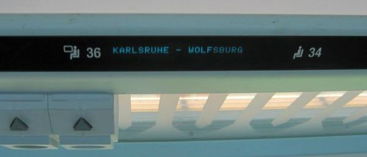
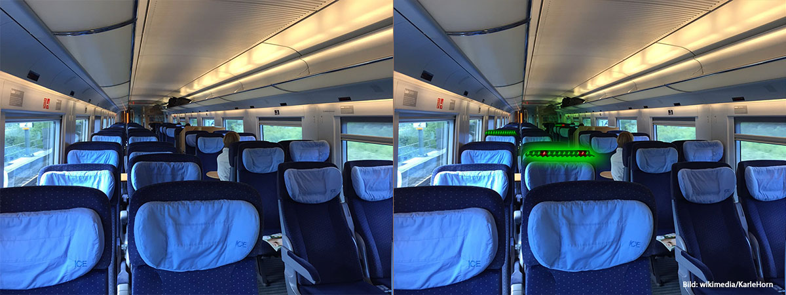

# Lightened Free Seat Finder

## 💡 idea
Show free seats with a light like free flats with blue light

### ❌ problem
People without reserved seat board the train and don't easily free seats. They have to look at small signs which also shows from where to where this seat is free.

### ✔️ solution
Use LED strips and connect them to reservation systems and show with lightened color (e.g. green) if they are now free and with a 2nd color in between (e.g. red) if they are free the whole trip.  

### 🧰 equipment
* LED strip
* connection to reservation system

## model
* blue lights for free flats

## 🌎 sources
* ICE view inside: https://de.wikipedia.org/wiki/Datei:ICE_Grossraum_innen.JPG
* reserved seat: http://bahnreise-wiki.de/wiki/Datei:Reservierungsanzeige_ICE.jpg
